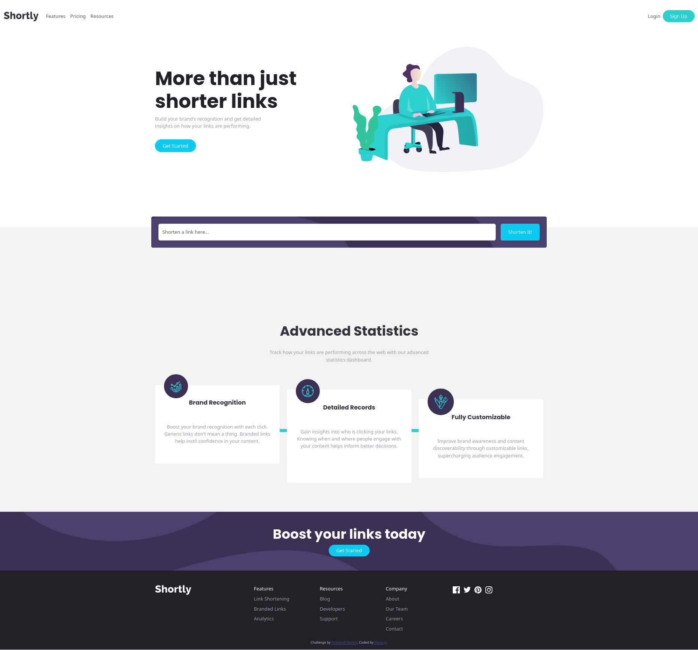

# Frontend Mentor - Shortly URL shortening API Challenge solution

This is a solution to the [Shortly URL shortening API Challenge challenge on Frontend Mentor](https://www.frontendmentor.io/challenges/url-shortening-api-landing-page-2ce3ob-G). Frontend Mentor challenges help you improve your coding skills by building realistic projects. 

## Table of contents

- [Overview](#overview)
  - [The challenge](#the-challenge)
  - [Screenshot](#screenshot)
  - [Links](#links)
  - [Built with](#built-with)
  - [What I learned](#what-i-learned)
  - [Continued development](#continued-development)
  - [AI Collaboration](#ai-collaboration)
- [Author](#author)

## Overview
- Replicate the design as close as possible 
- Use only vanilla html css javascript and bootstrap

### The challenge

Users should be able to:

- View the optimal layout for the site depending on their device's screen size
- Shorten any valid URL
- See a list of their shortened links, even after refreshing the browser
- Copy the shortened link to their clipboard in a single click
- Receive an error message when the `form` is submitted if:
  - The `input` field is empty

### Screenshot

### Links

- Solution URL: [Git Repo](https://github.com/Artprentice/kodeCamp-Task-0)
- Live Site URL: [urlshortner](https://urlshortner-jet-nine.vercel.app/)

### Built with

- Semantic HTML5 markup
- CSS custom properties
- Bootstrap
- Mobile-first workflow

### What I learned

Learned bootstrap and the concept of proxy servers when using api with vercel

### Continued development

Im going to keep looking into proxy servers and working with apis

**Note: Delete this note and replace the list above with resources that helped you during the challenge. These could come in handy for anyone viewing your solution or for yourself when you look back on this project in the future.**

### AI Collaboration

used ai to expain error i got and walk me through debugging

## Author

- Frontend Mentor - [@Artprentice](https://www.frontendmentor.io/profile/Artprentice)
- Twitter/X - [@ManuJr_dev](https://x.com/ManuJr_dev)